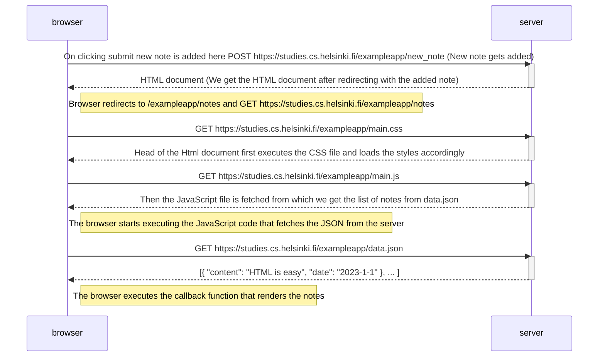

```mermaid
sequenceDiagram
    participant browser
    participant server

    browser ->>server : On clicking submit new note is added here POST https://studies.cs.helsinki.fi/exampleapp/new_note (New note gets added)
    activate server
    server -->> browser: HTML document (We get the HTML document after redirecting with the added note)
    deactivate server

    Note right of browser:  Browser redirects to /exampleapp/notes and GET https://studies.cs.helsinki.fi/exampleapp/notes

    browser->>server: GET https://studies.cs.helsinki.fi/exampleapp/main.css
    activate server
    server-->>browser: Head of the Html document first executes the CSS file and loads the styles accordingly
    deactivate server

    browser->>server: GET https://studies.cs.helsinki.fi/exampleapp/main.js
    activate server
    server-->>browser: Then the JavaScript file is fetched from which we get the list of notes from data.json
    deactivate server

    Note right of browser: The browser starts executing the JavaScript code that fetches the JSON from the server

    browser->>server: GET https://studies.cs.helsinki.fi/exampleapp/data.json
    activate server
    server-->>browser: [{ "content": "HTML is easy", "date": "2023-1-1" }, ... ]
    deactivate server

    Note right of browser: The browser executes the callback function that renders the notes

```
